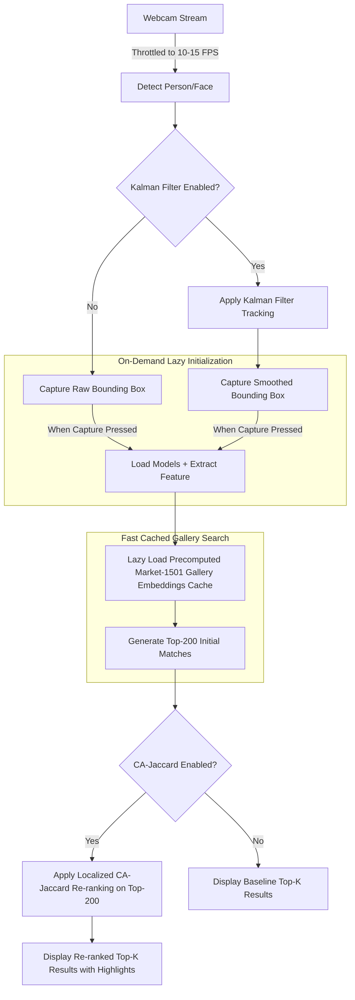

# FUNCTIONAL SPECIFICATION DOCUMENT (FSD)
## Person Re-Identification (Person Re-ID) Demo Application with Kalman Filter & CA-Jaccard Re-ranking

---

## 1. Overall System Architecture & Data Flow

The application operates as a closed-loop system, managing data from real-time webcam acquisition to final re-ranking and retrieval. It is optimized to run efficiently on student-grade hardware by prioritizing the **Market-1501** dataset, caching features, and lazy-loading deep learning libraries on-demand.

1. **Prioritized Dataset (Market-1501):** The pipeline is hardwired to prioritize the Market-1501 dataset (rather than GRID) to show robust evaluation metrics under standard academic settings.
2. **Lazy Model Initialization:** To keep startup time under 1 second, no deep learning models (PyTorch checkpoints) are loaded at app start. The model initialization is deferred until the user performs their first tracking capture or search query.
3. **Detection:** The system identifies people or faces from the incoming webcam feed.
4. **Tracking (Optional):** A [Kalman Filter](src/Kalman_filter) is applied to smooth out, predict, and stabilize the bounding boxes.
5. **Query Capture:** Crops of the query image are extracted on-demand based on either the raw detection box or the Kalman-smoothed box.
6. **Feature Extraction:** The system transforms the cropped image into a feature vector using the baseline model *only* when a capture event is triggered.
7. **Gallery Search:** Computes distance metrics (Cosine/Euclidean) between the query vector and the cached gallery database features.
8. **Re-ranking (Optional):** Applies the Context-Aware Jaccard ([CA-Jaccard](src/caj/utils/rerank.py)) algorithm to optimize the retrieval order of the top matches.
9. **Result Output:** Displays the final ordered top matches (Top-K) on the UI.

---

## 2. Core Features & Functional Requirements

* **Data Source & Configuration Management:**
    - Real-time webcam feed toggling.
    - Support for loading datasets, prioritizing **Market-1501 (Default & Pre-configured)** and supporting `Custom` folders.
    - Manual Camera ID input field to simulate multi-camera environments.

* **Computer Vision & Tracking Processing:**
    - Automatic face/person detection.
    - Double bounding box overlays: **Red Box** for raw model detections and **Green Box** for the Kalman-smoothed target state.
    - Real-time tracking status indicators: `Found` vs. `Missing` detector states.
    - Dynamic Kalman state switches: `Update` mode (when the target is found) and `Predict only` mode (when the detector loses the target).

* **Query Capturing & Storage:**
    - Triggerable query image capture directly from the live video feed bounding boxes.
    - File-system archiving that automatically routes images to `captured/original/` or `captured/kalman/` depending on the active bounding box state.

* **Re-ID Evaluation & Optimization:**
    - Toggle switch for CA-Jaccard Re-ranking optimization.
    - Adjustable Top-K configuration (e.g., Top-5 or Top-10 arrays).
    - Visual comparative analysis workflows to benchmark the accuracy differences with and without tracking/re-ranking enhancements.

---

## 2.1. Performance & Non-Functional Optimization Requirements

To prevent UI lag, application freezing, and GPU memory exhaustion during the demo, the following software engineering optimizations are implemented:

* **Instant Startup (Zero App Start Overhead):**
  * **No Neural Networks are loaded at app start.** Model initialization (loading PyTorch weights) occurs strictly on-demand on the first query capture.
  * **No feature extraction is run at app start.** The app launches instantly with empty model caches.
* **Precomputed Embedding Caching:**
  * To avoid running feature extraction on the entire 19,732-image gallery database every run, all gallery embedding vectors are precomputed offline and cached in `market1501_gallery_features.npy`.
  * **Lazy Cache Loading:** This cached `.npy` file is only read into RAM when the user runs their first search query, avoiding load latency during app initialization.
* **Localized Top-N Re-ranking:**
  * To avoid running the expensive Jaccard neighbor computation on the entire 19,732-image Market-1501 database, CA-Jaccard is restricted to a **Top-200** subset.
  * The app performs a fast Cosine similarity query on all cached gallery embeddings, extracts the top 200 IDs, and executes CA-Jaccard *only* on this localized pool. This drops computation time from minutes to under $0.05$ seconds.
* **Camera Frame Rate Throttling:**
  * Webcam frame acquisition is throttled to **10-15 FPS** (instead of 30-60 FPS).
  * This prevents the object detection queue from backing up and ensures the UI remains responsive to user input.
* **On-Demand Neural Network Inference:**
  * Bounding box tracking (detection and Kalman filter) is kept lightweight.
  * The heavy deep-learning feature extractor is only invoked when the user explicitly clicks `[Capture Query]`.

---

## 3. UI/UX Interface Specification

The user interface is architected into three primary tabs to isolate specialized evaluation environments.

### 3.1. Tab 1: Realtime Capture / Kalman Demo 

Designed for live camera feeds, bounding box monitoring, and query capture initialization.

* **Left Panel - Live Video Feed (Webcam Stream):**
    - Renders the real-time webcam feed.
    - Overlays a **Red Box** indicating raw object detections.
    - Overlays a **Green Box** tracking the Kalman-predicted path (visible only when Kalman is switched on).

* **Right Panel - Control Panel:**
    - `Checkbox` [ ] Use Kalman Filter.
    - `Label` Detector Status: `Found` / `Missing`.
    - `Label` Kalman Mode: `Update` / `Predict only`.
    - `Input Field` Camera ID: Text entry to modify the source camera tag manually.
    - `Button` [Reset Tracker]: Re-initializes the Kalman state vectors.
    - `Button` [Capture Query]: Instantly crops and saves the image from the active bounding box.

* **Bottom Section - Capture Information:**
    - Displays a image preview of the cropped query.
    - Meta-labels: Capture Source (`Raw` or `Kalman bbox`), Camera ID, and Optional Frame Quality analytics.

---

### 3.2. Tab 2: Gallery Search / CA-Jaccard Demo 

Engineered to perform person searches against datasets and to demonstrate CA-Jaccard re-ranking.

* **Query Input & Management:**
    - Allows uploading raw image files or selecting previously saved photos from the `captured/` directory.
    - Dataset selector options: **Market-1501 (Default)** or `Custom`.
    - Displays the active `Query Image Preview` and its associated `Query camera ID`.

* **Search Control Panel:**
    - `Checkbox` [ ] Use CA-Jaccard Re-ranking.
    - `Dropdown/Selector` Top-K: Choose between `5` or `10` slots.
    - `Button` [Search Gallery]: Executes the distance matrix ranking pipeline.
      * *UX Integration:* Shows a full-screen loading spinner (`show_progress="full"`) on click and disables the search button to block concurrent requests and UI freezes. Loads the gallery embedding caches lazily upon first click.
    - `Button` [Clear Result]: Wipes the active results grid for a clean slate.

* **Results Panel:**
    - Displays two distinct rows/grids of matching image arrays side-by-side or stacked for easy comparison:
        1. **Baseline Top-K Results:** Ordered purely by baseline Cosine/Euclidean metrics.
        2. **Final Top-K Results:** Displays the adjusted ranking matrix.
    - **UI Enhancements:**
        * **Same-Camera Highlight:** If a match comes from the same Camera ID as the query, it is outlined in **Yellow** (to visually demonstrate the same-camera bias).
        * **Rank Change Highlight:** If a match's rank improves due to CA-Jaccard (e.g. shifts from position 5 to position 1), it is highlighted with a **Green border or rank change badge**.
    - **System Logic:** If `CA-Jaccard` is turned OFF, the Final list completely mirrors the Baseline list. If turned ON, the Final list populates with the re-ranked CA-Jaccard matrix.

---

### 3.3. Tab 3: Four-Mode Top-5 Comparison 

An advanced scientific workbench interface meant to contrast all combinations of the tracking and re-ranking algorithms simultaneously.

* **Top Section - Query Matrix Setup:**
    - Features 2 dedicated image upload containers:
        1. **Raw Query Image Component:** Explicitly designated for the raw crop (Red box output from Tab 1).
        2. **Kalman-smoothed Query Image Component:** Explicitly designated for the Kalman crop (Green box output from Tab 1).
    - `Button` [Run 4-Mode Comparison]: A mandatory action button. The 4 individual processing threads will not compute until this button is pressed.
      * *UX Integration:* Renders loading indicators on all 4 output galleries concurrently to show comparison calculations are in progress.

* **Bottom Section - 4-Column/Grid Comparison Engine:**
    - Renders 4 distinct horizontal galleries, each displaying its own isolated **Top-5** results based on the following environment parameters:

| Mode Indicator | Filter Parameter | Re-ranking Parameter | Computational Protocol |
| --- | --- | --- | --- |
|  **Mode 1** | Kalman **OFF** | CA-Jaccard **OFF** | Processes Raw Query Image using standard Cosine similarity. |
|  **Mode 2** | Kalman **ON** | CA-Jaccard **OFF** | Processes Kalman-smoothed Query Image using standard Cosine similarity. |
|  **Mode 3** | Kalman **OFF** | CA-Jaccard **ON** | Processes Raw Query Image, then re-orders the output via CA-Jaccard re-ranking. |
|  **Mode 4** | Kalman **ON** | CA-Jaccard **ON** | Processes Kalman-smoothed Query Image, then re-orders the output via CA-Jaccard re-ranking. |
