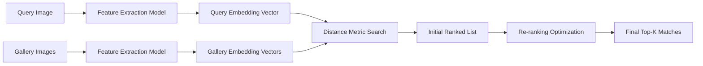
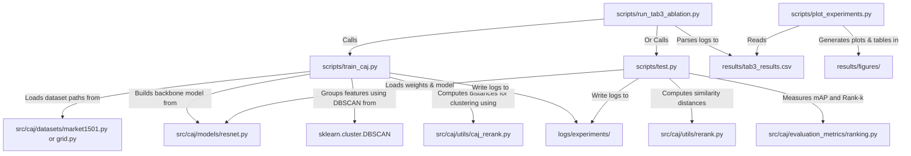
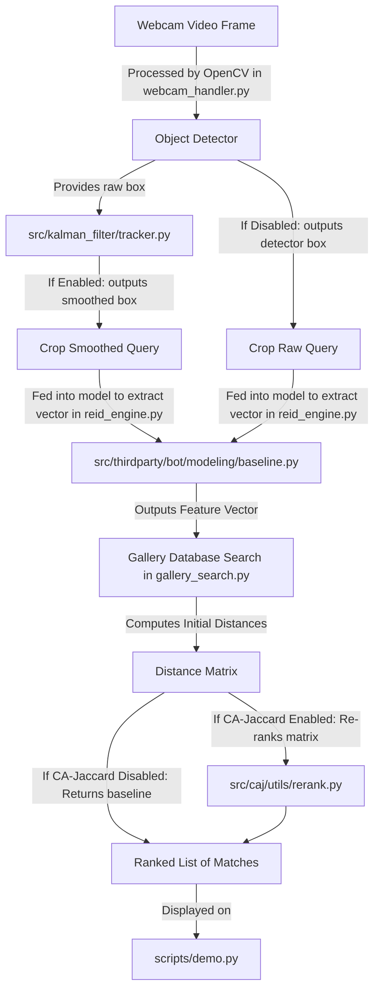

# Software Engineering Student Guide: Person Re-Identification Project

Welcome to your Person Re-Identification (Person Re-ID) project! As a Software Engineering student, analyzing a new codebase can feel like navigating a maze. This document is designed to give you a clear map of the repository, explain the core computer vision and tracking algorithms, detail the technology stack, and show you how the files connect together.

---

## 1. What is Person Re-Identification (Person Re-ID)?

In simple terms, **Person Re-ID** is the task of matching a person's identity across different, non-overlapping camera feeds. It is treated as an **Image Retrieval** problem:

1. **Query:** You have an image of a person of interest (e.g., cropped from Camera A).
2. **Gallery:** You have a database of images captured from other cameras (e.g., Cameras B, C, D).
3. **Task:** Search the Gallery and return a ranked list of the most visually similar images to the Query.

### The Standard Re-ID Pipeline

---

## 2. The Core Algorithms

Your project is built around two key algorithms: the **Kalman Filter** (for real-time tracking) and **CA-Jaccard** (for search optimization).

### A. Kalman Filter (Target Tracking)
*Implemented under:* [src/kalman_filter/](../src/kalman_filter)

A **Kalman Filter** is an mathematical algorithm used to estimate the "true state" of a moving object (its position and velocity) over time, even when the observations (from a person detector) are noisy or temporarily missing.

#### Physical Intuition
Think of how you track a friend walking through a crowded room. If they briefly walk behind a pillar (an **occlusion**), your brain doesn't assume they disappeared. Based on their speed and direction, you estimate where they will reappear. The Kalman Filter does exactly this mathematically.

#### The Predict-Update Cycle
The filter runs in a continuous loop consisting of two phases:
1. **Predict:** Using a physical motion model (e.g., constant velocity), it predicts where the bounding box will be in the next frame.
   $$\text{State Vector } x = [pos_x, pos_y, scale, aspect\_ratio, velocity_x, velocity_y]^T$$
2. **Update:** When a detector (like a YOLO or Haar-cascade model) finds the person, it provides a measurement. The filter compares this measurement with its prediction, corrects its internal state, and produces a smoothed bounding box.

#### Why use it in a Re-ID Demo?
* **Handles Occlusions:** If a person is blocked for a few frames, the filter keeps tracking them in "Predict only" mode.
* **Smoothes Bounding Boxes:** Detector boxes can "jitter" (jump around). Jitter leads to bad crops. The Kalman filter stabilizes the box (producing the **Green Box** in your UI design), ensuring clean and consistent crops for feature extraction.

---

### B. CA-Jaccard (Camera-Aware Jaccard Re-ranking)
*Implemented in:* [rerank.py](../src/caj/utils/rerank.py) and [caj_rerank.py](../src/caj/utils/caj_rerank.py)

#### 1. What is Re-ranking?
When you extract features from a query and gallery, you compute their initial distance (Cosine/Euclidean similarity). However, visual appearance alone is often insufficient. **Re-ranking** is a post-processing step that analyzes the neighborhood relationships. 

It uses the **k-reciprocal nearest neighbors** concept: If Image A is in the top-k neighbors of Image B, and Image B is also in the top-k neighbors of Image A, they are highly likely to be the same identity. We compute a similarity score based on how many neighbors they share (using the **Jaccard Distance**).

#### 2. The Camera Bias Problem
In real-world surveillance:
* Cam 1 might be outdoors (bright sunlight).
* Cam 2 might be indoors (yellow fluorescent light).
* A person's clothes will look completely different in these two cameras.
* Standard models suffer from **camera bias**: they tend to rank same-camera distractors higher because the background and lighting match, while missing the true matches in different cameras.

#### 3. How CA-Jaccard Solves It
**Camera-Aware Jaccard (CA-Jaccard)** splits the neighbor searches:
* **Intra-Camera Neighbors (`k1_intra`):** Matches found within the *same* camera feed.
* **Inter-Camera Neighbors (`k1_inter`):** Matches found across *different* camera feeds.

By separating these pools, the algorithm calculates a cross-camera similarity metric that dilutes the environmental bias, leading to a substantial boost in Rank-1 and mAP accuracy.

---

## 3. Technology Stack & Frameworks

The project leverages several Python libraries to handle deep learning, data processing, and user interfaces:

| Library | Role in Project | Where it is used |
| :--- | :--- | :--- |
| **PyTorch (`torch`)** | Deep learning framework. Used to load pre-trained CNNs, extract features, and train the Re-ID model. | [train_caj.py](../scripts/train_caj.py), [src/caj/models/](../src/caj/models/) |
| **Gradio** | Web UI framework. Creates the interactive tabs, video views, and buttons for your demo application. | [demo.py](../scripts/demo.py) |
| **OpenCV (`opencv-python`)** | Image & Video processing. Reads webcam frames, draws the raw (**Red**) and tracked (**Green**) bounding boxes, and crops query images. | [webcam_handler.py](../src/app/webcam_handler.py) |
| **Scikit-learn (`sklearn`)** | Machine Learning algorithms. Provides the **DBSCAN** clustering algorithm used to group similar features together during training. | [train_caj.py](../scripts/train_caj.py#L12) |
| **YACS** | Configuration management. Used by the Bag-of-Tricks (BoT) baseline to load YAML configurations cleanly. | [thirdparty/bot/](../thirdparty/bot/) |
| **NumPy / SciPy** | Scientific computing. Performs vector math, calculates distance matrices, and sorts rankings. | [rerank.py](../src/caj/utils/rerank.py) |

> [!NOTE]
> For a detailed code analysis and library usage walkthrough, see the [Source Code Deep-Dive Guide](code_deep_dive.md).

---

## 4. Directory Structure Description

Here is an architectural map of your repository. 

*   `in-allies-eyes/` (Root)
    *   [README.md](../README.md) - Project setup, installation steps, and commands for experiments.
    *   [requirements.txt](../requirements.txt) - Python package dependencies.
    *   [thirdparty/bot/](../thirdparty/bot/) - Sub-repository containing the **Bag-of-Tricks (BoT)** Re-ID baseline model structures.
    *   [pretrained_models/](../pretrained_models/) - Folder for holding loaded/trained Re-ID model weights.
    *   [data/](../data/) - Target folder for holding Market1501 and CUHK03 raw datasets.
    *   [scripts/](../scripts) (Execution Scripts)
        *   [demo.py](../scripts/demo.py) - Interactive Gradio demo app incorporating webcam/tracking and gallery search.
        *   [download_datasets.py](../scripts/download_datasets.py) - Automates downloads of Market1501 and GRID datasets.
        *   [download_pretrained_models.py](../scripts/download_pretrained_models.py) - Fetches ResNet50 backbone weights and trained checkpoints.
        *   [train_caj.py](../scripts/train_caj.py) - Training loop for CA-Jaccard model using ClusterMemory.
        *   [test.py](../scripts/test.py) - Evaluation script to measure model performance (mAP, Rank-1).
        *   [run_tab3_ablation.py](../scripts/run_tab3_ablation.py) - Runs ablation experiments (reproducing Table 3 from the reference paper).
        *   [run_fig4_params.py](../scripts/run_fig4_params.py) - Runs hyperparameter sweeps for clustering.
        *   [plot_experiments.py](../scripts/plot_experiments.py) - Generates figures and result tables from experimental logs.
    *   [src/](../src) (Core Library Logic)
        *   [app/](../src/app) - Helper modules for the Gradio demo application:
            *   [webcam_handler.py](../src/app/webcam_handler.py) - Handles webcam video capture, Haar cascade detector, and target crop extraction.
            *   [gallery_search.py](../src/app/gallery_search.py) - Orchestrates query processing, gallery search, and CA-Jaccard re-ranking.
            *   [reid_engine.py](../src/app/reid_engine.py) - Manages lazy-loading and inference of deep learning Re-ID models.
        *   [kalman_filter/](../src/kalman_filter) - Kalman filter tracking implementation (`tracker.py`) used to smooth noisy bounding boxes.
        *   [caj/](../src/caj) (Camera-Aware Jaccard Model Library)
            *   [datasets/](../src/caj/datasets) - Specialized dataset parsers (GRID, Market1501, MSMT17).
            *   [models/](../src/caj/models) - Model structures (ResNet backbone, ClusterMemory module).
            *   [evaluation_metrics/](../src/caj/evaluation_metrics) - Code for calculating CMC curves and mAP.
            *   [utils/](../src/caj/utils) - CA-Jaccard mathematical engines ([rerank.py](../src/caj/utils/rerank.py) and [caj_rerank.py](../src/caj/utils/caj_rerank.py)).

---

## 5. Connections Between Files (The Architecture Flow)

Understanding how files invoke each other helps you debug and expand the system. Below are the two primary workflows in your repository.

### Workflow A: The Training & Evaluation Pipeline
This flow describes how you run experiments, validate configurations, and plot results.

### Workflow B: The Gradio Demo Application
This flow illustrates how the components in the demo application interact at runtime.

---

## 6. Software Engineering Concepts to Keep in Mind

As a Software Engineering student, you can appreciate the architectural decisions made in this repository:

1. **Separation of Concerns (SoC):** 
   The business/algorithmic logic lives strictly inside the `src/` folder. The `scripts/` folder only contains execution wrapper files. This ensures that you can reuse your core algorithms (like `caj`) in multiple different applications (like a CLI script or a Gradio web app) without rewriting code.
2. **Adapter Pattern (Integration of Third-Party Code):**
   The project integrates a baseline model from a separate framework (Bag-of-Tricks under `src/thirdparty/bot/`). To make this third-party model compatible with the testing scripts of the CA-Jaccard framework, the project uses the [convert_bot_state_dict](../scripts/test.py#L43) adapter function in `../scripts/test.py` to translate model weights between formats dynamically.
3. **Parametrization & Clean Configurations:**
   Rather than hardcoding parameters like learning rates, number of epochs, or camera parameters, the project stores them in `.yml` files (under `src/thirdparty/bot/configs/`) or loads them from centralized files like [experiment_utils.py](../scripts/experiment_utils.py). This makes experiments reproducible and easy to configure.

---

## 7. Future Extension Ideas

Now that the core tracking and Re-ID search pipelines are fully implemented and integrated into the Gradio interface, here are some excellent software engineering extensions you could explore next:
1. **Real-time Bounding Box Association**: Upgrade the single-person Haar cascade face tracker to multi-target tracking (e.g., integrating IoU association or Hungarian matching with Kalman prediction).
2. **Dynamic Gallery Caching**: Optimize gallery indexing by running feature extraction asynchronously or caching embeddings using a lightweight database (like SQLite or Faiss indices).
3. **Advanced Visualizations**: Embed real-time distance metrics and top-K query confidence scores directly onto the Gradio matches gallery.
