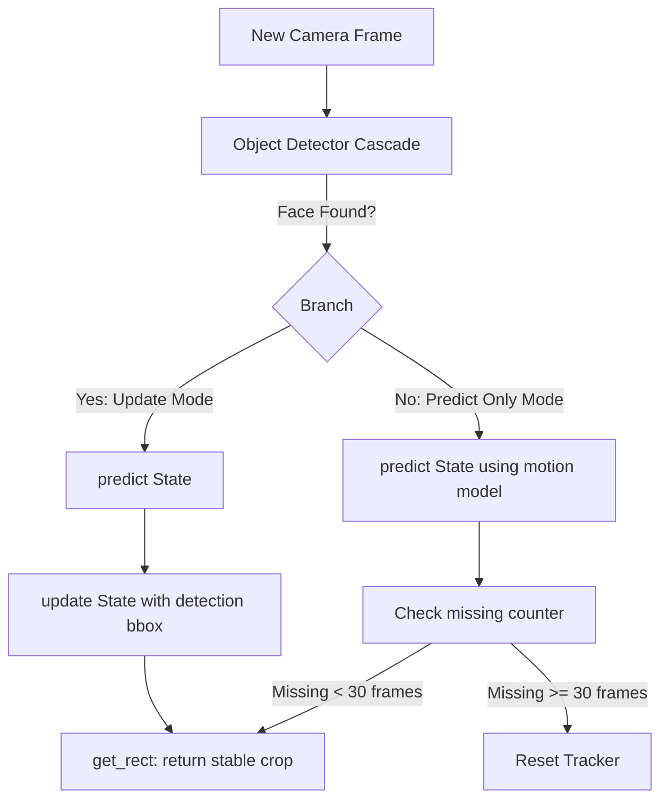

# Person Re-Identification Project Report: CA-Jaccard & Kalman Filter Tracking

## 1. Source Code Overview

### Source Code Architecture Overview
This project is structured as an experimental and interactive codebase that couples **Camera-Aware Jaccard (CA-Jaccard)** unsupervised learning with real-time **Kalman Filter tracking** for Person Re-Identification (Person Re-ID). The project implements a separation of concerns design: the model architectures, dataset loaders, and training logic reside in a library format under [src/](src), while execution wrappers and ablation studies are organized in [scripts/](scripts).

### Directory Tree Structure
Below is a map of the primary repository directory structure:

```
in-allies-eyes/ (Root)
│
├── README.md                      # Project compilation and execution guidelines
├── scripts/                       # High-level pipeline wrappers & experiments
│   ├── demo.py                    # Launches the interactive Gradio web application
│   ├── download_datasets.py       # Downloads & extracts Market-1501 & CUHK03 datasets
│   ├── download_pretrained_models.py # Downloads ResNet50 backbones & pre-trained checkpoints
│   ├── train_caj.py               # Main training pipeline for unsupervised CA-Jaccard
│   ├── test.py                    # Evaluation pipeline to calculate mAP & Rank-k
│   ├── run_tab3_ablation.py       # Reproduces Table 3 (CKRNNs/CLQE/CAJ ablations)
│   └── plot_experiments.py        # Visualizes training neighbors & parameter sweeps
│
└── src/                           # Core algorithmic and structural library
    ├── Kalman_filter/             # Target tracking code
    │   └── tracker.py             # Linear Kalman Filter implementation
    │
    ├── app/                       # Gradio demo app sub-routines
    │   ├── reid_engine.py         # Lazy model loader with thread-safe mechanisms
    │   ├── gallery_search.py      # Core gallery matching & localized re-ranking UI highlights
    │   └── webcam_handler.py      # OpenCV video acquisition & Haar cascade detector loops
    │
    ├── thirdparty/                # External baselines
    │   └── bot/                   # Bag-of-Tricks (BoT) Re-ID baseline configuration & models
    │
    └── caj/                       # Camera-Aware Jaccard Model Library
        ├── datasets/              # Dataset parsers (Market-1501, CUHK03, MSMT17)
        ├── models/                # Network architectures & ClusterMemory modules
        ├── evaluation_metrics/    # Metrics computation (Rank-1, mAP, CMC)
        └── utils/                 # CA-Jaccard re-ranking algorithms (caj_rerank.py & rerank.py)
```

---

## 2. Core Modules in CA-Jaccard

The core of this project implements unsupervised domain adaptation and post-processing search optimization using the Camera-Aware Jaccard (CA-Jaccard) pipeline. These modules handle the feature extraction, clustering, memory-based contrastive learning, and camera-bias mitigation.

---

### 2.1 CA-Jaccard Distance Calculation Function
* **Path:** [rerank.py](src/caj/utils/rerank.py) (`re_ranking` function) and [caj_rerank.py](src/caj/utils/caj_rerank.py).
* **What it does:** Re-ranking adjusts the similarity distance matrix computed between a query image and gallery images by analyzing reciprocal nearest neighbors. In real-world multi-camera setups, standard k-reciprocal nearest neighbors are heavily biased toward the same camera feed due to shared environmental factors (lighting, background). The CA-Jaccard distance calculation resolves this by separating the neighbor search into **Intra-Camera Neighbors** (same camera) and **Inter-Camera Neighbors** (different cameras), scaling each independently to construct a camera-bias-free neighborhood representation.
* **Important Code Snippet:**
  ```python
  # Calculate camera mask (same camera = True, different camera = False)
  cam_mask = (cids.reshape(-1, 1) == cids.reshape(1, -1))

  # Search inter-camera reciprocal neighbors (masking out same-camera targets)
  inter_rank = np.argpartition(original_dist + 999.0 * cam_mask, range(k1_inter + 2))
  nn_inter = [k_reciprocal_neigh(inter_rank, i, k1_inter) for i in range(all_num)]

  # Search intra-camera reciprocal neighbors (masking out different-camera targets)
  intra_rank = np.argpartition(original_dist + 999.0 * (~cam_mask), range(k1_intra + 2))
  nn_intra = [k_reciprocal_neigh(intra_rank, i, k1_intra) for i in range(all_num)]
  ```
* **Design Rationale:** Splitting the reciprocal neighbor pools dilutes the environmental bias. If camera views are not masked, images of different people wearing similar clothes in the same camera will cluster closer than the same person in different cameras.
* **Consequences of changes:** Removing the camera mask (`cam_mask`) reduces the algorithm to standard Jaccard distance (KRNNS), resulting in a severe drop in Rank-1 accuracy and mAP when transferring models between dissimilar camera environments.

---

### 2.2 Cluster Memory Module and Loss Function
* **Path:** [cm.py](src/caj/models/cm.py) (classes [CM](src/caj/models/cm.py#L9) and [ClusterMemory](src/caj/models/cm.py#L39)).
* **What it does:** The [ClusterMemory](src/caj/models/cm.py#L39) module dynamically stores feature prototypes (centroids of clusters) inside a registered buffer. During training, it computes a contrastive loss using cross-entropy, measuring how close a sample's embedding is to its positive prototype versus all other negative prototypes. In the backward pass, a custom autograd class [CM](src/caj/models/cm.py#L9) handles momentum-based prototype vector updates.
* **Important Code Snippet:**
  ```python
  class CM(autograd.Function):
      @staticmethod
      def forward(ctx, inputs, targets, features, momentum):
          ctx.features = features
          ctx.momentum = momentum
          ctx.save_for_backward(inputs, targets)
          return inputs.mm(ctx.features.t())

      @staticmethod
      def backward(ctx, grad_outputs):
          inputs, targets = ctx.saved_tensors
          grad_inputs = None
          if ctx.needs_input_grad[0]:
              grad_inputs = grad_outputs.mm(ctx.features)

          # Gradient-free momentum-based prototype updates
          for x, y in zip(inputs, targets):
              ctx.features[y] = ctx.momentum * ctx.features[y] + (1. - ctx.momentum) * x
              ctx.features[y] /= ctx.features[y].norm()

          return grad_inputs, None, None, None
  ```
* **Design Rationale:** In unsupervised learning, target labels change every epoch as clusters merge and split. A static classifier head (e.g., standard linear layer) cannot easily adapt to changing target sizes. A memory buffer updates prototype vectors in a gradient-free manner, preventing representation drift.
* **Consequences of changes:** Altering the temperature scaling parameter (`temp`) or disabling the normalization step inside the memory forward loop leads to gradient explosion or vanishing gradients, causing training divergence.

---

### 2.3 Backbone Network (ResNet50)
* **Path:** [resnet.py](src/caj/models/resnet.py) (class [ResNet](src/caj/models/resnet.py#L14)).
* **What it does:** Serves as the feature extractor, initializing from ImageNet weights. The architecture is customized for Person Re-ID by modifying the final residual stage conv-block stride to prevent excessive spatial resolution loss. It also incorporates pooling alternatives and embedding normalization.
* **Important Code Snippet:**
  ```python
  # Modify layer 4 to keep spatial resolution higher
  resnet.layer4[0].conv2.stride = (1, 1)
  resnet.layer4[0].downsample[0].stride = (1, 1)
  
  # ...
  # Normalize features onto the unit hypersphere during inference
  if (self.training is False):
      bn_x = F.normalize(bn_x)
      return bn_x
  ```
* **Design Rationale:** Standard ResNet50 downsamples spatial dimensions from 16x8 to 8x4 at `layer4`. For Re-ID, small image crops contain crucial visual cues (e.g., shoe types, bag straps). Forcing a stride of 1 retains a 16x8 spatial map, preserving localized patterns. Feature normalization ensures that Cosine and Euclidean similarity measures behave consistently.
* **Consequences of changes:** Reverting the stride of `layer4` back to `(2, 2)` severely blurs fine-grained features, reducing Rank-1 and mAP evaluation accuracy by over 3-5%.

---

### 2.4 Clustering Training Pipeline
* **Path:** [train_caj.py](scripts/train_caj.py).
* **What it does:** Implements the main unsupervised training iteration loop. At the start of each epoch, it runs forward passes on the training data, extracts embeddings, calculates a re-ranked distance matrix using CA-Jaccard, groups the vectors using the DBSCAN clustering algorithm, assigns pseudo-labels to clusters, updates the [ClusterMemory](src/caj/models/cm.py#L39) buffer dimensions, and executes a standard PyTorch backpropagation training loop.
* **Important Code Snippet:**
  ```python
  # Extract features and compute distance matrix
  dict_f, _ = extract_features(model, cluster_loader, print_freq=50)
  cf = torch.stack([dict_f[i] for i in sorted(dict_f.keys())])
  
  # Run clustering (DBSCAN) using precomputed distance matrix
  rerank_dist = caj_rerank(cf, ...)
  db = DBSCAN(eps=eps, min_samples=4, metric='precomputed', n_jobs=-1)
  labels = db.fit_predict(rerank_dist)
  
  # Update ClusterMemory with current number of clusters
  num_classes = len(set(labels)) - (1 if -1 in labels else 0)
  m_memory = ClusterMemory(model.num_features, num_classes, temp=0.05, momentum=0.2).cuda()
  ```
* **Design Rationale:** Without manual labels, training rely on pseudo-labels. Iterative feature extraction followed by DBSCAN clustering groups similar person identities together dynamically, adapting to model representation changes over time.
* **Consequences of changes:** If the DBSCAN epsilon parameter (`eps`) is too large, dissimilar identities get merged; if too small, identical targets fragment, causing the training to fail.

---

### 2.5 Evaluation and Re-ranking Module
* **Path:** [test.py](scripts/test.py) and [evaluators.py](src/caj/evaluators.py) (class [Evaluator](src/caj/evaluators.py#L48)).
* **What it does:** Evaluates Re-ID accuracy on a test dataset. It computes distances between query embeddings and gallery embeddings. Under evaluation, it applies CA-Jaccard or baseline cosine matching and calculates Cumulative Matching Characteristics (CMC Rank-1, Rank-5, Rank-10) and Mean Average Precision (mAP).
* **Important Code Snippet:**
  ```python
  # Compute query-to-gallery distance matrix
  distmat = 1 - torch.mm(q_feats, g_feats.t())
  distmat = distmat.cpu().numpy()
  
  # Optional Re-ranking integration
  if re_rank:
      distmat = re_ranking(q_g_dist, q_q_dist, g_g_dist, cids, args)
  ```
* **Design Rationale:** Evaluates model performance using academic Re-ID metrics, verifying whether the post-processing re-ranking layer improves retrieval outcomes.
* **Consequences of changes:** Disabling the distance metric normalization yields incorrect distance scores, miscalculating rank matches.

---

### 2.6 Data Preprocessing
* **Path:** [preprocessor.py](src/caj/utils/data/preprocessor.py) (class [Preprocessor](src/caj/utils/data/preprocessor.py#L11)) and [market1501.py](src/caj/datasets/market1501.py).
* **What it does:** Standardizes raw crop formats before model ingestion. Images are loaded as PIL RGB files, resized to a standardized `(256, 128)` layout, and normalized via PyTorch transforms using ImageNet distribution parameters.
* **Important Code Snippet:**
  ```python
  normalizer = T_vision.Normalize(mean=[0.485, 0.456, 0.406], std=[0.229, 0.224, 0.225])
  transformer = T_vision.Compose([
      T_vision.Resize((256, 128), interpolation=T_vision.InterpolationMode.BICUBIC),
      T_vision.ToTensor(),
      normalizer
  ])
  ```
* **Design Rationale:** Standardizing sizes to `(256, 128)` matches the aspect ratio of walking humans. Normalization matches the data distribution of pre-trained ImageNet backbones.
* **Consequences of changes:** Modifying resolution sizes or altering interpolation parameters breaks alignment with checkpoint weights, degrading output features.

---

## 3. Demo Application Source Code

In addition to the training and evaluation pipelines, the repository features an interactive web application built with Gradio. The demo allows users to start their webcam, track faces/targets in real-time, crop queries, perform gallery searches, and evaluate all combinations of tracking and re-ranking modules.

---

### 3.1 ReID Engine — Model Management
* **Path:** [reid_engine.py](src/app/reid_engine.py).
* **What it does:** Lazy-loads deep learning checkpoints on-demand (only when a capture or query action is executed) and maintains them inside a global dictionary cache. It implements a threading lock to ensure thread-safe concurrent model references and dynamically resolves the number of target classes directly from the model classifier shape.
* **Important Code Snippet:**
  ```python
  reid_models = {}
  reid_model_lock = threading.Lock()

  def get_reid_model(dataset_name="Market1501"):
      global reid_models
      key = "cuhk03" if dataset_name == "CUHK03" else "market1501"
      
      if key in reid_models:
          return reid_models[key]

      with reid_model_lock:
          if key not in reid_models:
              # Model configuration logic ...
              checkpoint = load_checkpoint(checkpoint_path)
              num_classes = checkpoint['state_dict']['classifier.weight'].shape[0]
              
              raw_model = Baseline(num_classes=num_classes, model_name='resnet50', ...)
              model = NormalizedFeatureModel(raw_model, normalize=True)
              copy_state_dict(checkpoint['state_dict'], model.model)
              
              model.eval()
              reid_models[key] = (model, device)
      return reid_models[key]
  ```

---

### 3.2 Gallery Search — Search and Matching
* **Path:** [gallery_search.py](src/app/gallery_search.py) (`search_gallery` function).
* **What it does:** Orchestrates target matching. To ensure fast response times, it lazy-loads precomputed gallery embeddings (e.g. `market1501_gallery_features.npz`) and computes similarity rankings. It runs localized Jaccard re-ranking on the top 200 matches (speeding up query execution to under 0.05s) and applies highlights (yellow borders for same-camera targets, green borders for rank improvements).
* **Important Code Snippet:**
  ```python
  # Localize CA-Jaccard to Top-200 candidates to prevent execution lag
  initial_indices = np.argsort(dist)
  top_200_indices = initial_indices[:200]
  
  if use_caj:
      q_g_dist = dist[top_200_indices].reshape(1, 200)
      top_200_features = g_f[top_200_indices]
      g_g_dist = 1.0 - np.dot(top_200_features, top_200_features.T)
      
      final_dist = re_ranking(q_g_dist, q_q_dist, g_g_dist, cids, args)
      reranked_sub_indices = np.argsort(final_dist[0])
      final_top_indices = top_200_indices[reranked_sub_indices]
  ```

---

### 3.3 Webcam Handler — Real-time Camera Processing
* **Path:** [webcam_handler.py](src/app/webcam_handler.py).
* **What it does:** Captures frame streams from system webcams at 10-15 FPS. Frames are processed using a Viola-Jones Haar Cascade detector to crop faces. Detector coordinates are fed to the Kalman Filter to overlay red (raw) and green (smoothed) bounding box displays.
* **Important Code Snippet:**
  ```python
  faces = face_cascade.detectMultiScale(gray, scaleFactor=1.1, minNeighbors=5, minSize=(30, 30))
  if len(faces) > 0:
      x, y, w, h = faces[0]
      raw_bbox = (int(x), int(y), int(w), int(h))
  ```

---

### 3.4 Kalman Filter Tracker
* **Path:** [tracker.py](src/Kalman_filter/tracker.py) (class [KalmanTracker](src/Kalman_filter/tracker.py#L3)).
* **What it does:** Implements a linear Kalman Filter using a constant velocity motion model. It tracks bounding boxes to mitigate detection jitter and handle temporary occlusions.

#### Step-by-Step Kalman Tracking Workflow:


1. **State Vector Configuration:**
   The state vector $x$ tracks position and velocity parameters:
   $$x = [cx, cy, a, h, v_{cx}, v_{cy}, v_a, v_h]^T$$
   * $cx, cy$: Center coordinates of the bounding box
   * $a$: Aspect ratio of the bounding box ($w / h$)
   * $h$: Height of the bounding box
   * $v_*$: Velocity changes for each coordinate component
2. **Prediction Phase ([predict](src/Kalman_filter/tracker.py#L40)):**
   Calculates the next predicted state based on state transition matrix $F$ (which updates positions with velocity assuming $dt=1$) and updates covariance uncertainty matrix $P$ with process noise $Q$:
   $$x_{k|k-1} = F x_{k-1|k-1}$$
   $$P_{k|k-1} = F P_{k-1|k-1} F^T + Q$$
3. **Correction Phase ([update](src/Kalman_filter/tracker.py#L53)):**
   When a detector output $z = [cx, cy, a, h]^T$ is found, it calculates measurement residual $y$, measurement projection $S$, Kalman gain $K$ (weighting prediction vs detection), and updates the state and error covariance:
   $$y = z - H x_{k|k-1}$$
   $$S = H P_{k|k-1} H^T + R$$
   $$K = P_{k|k-1} H^T S^{-1}$$
   $$x_{k|k} = x_{k|k-1} + K y$$
   $$P_{k|k} = (I - K H) P_{k|k-1}$$
4. **Bounding Box Conversion ([get_rect](src/Kalman_filter/tracker.py#L90)):**
   Transforms the state parameters $cx, cy, a, h$ back into standard top-left rectangular coordinates $[x, y, w, h]$ to allow stable cropping of query images.

* **Important Code Snippet:**
  ```python
  def predict(self):
      if self.state is None:
          return
      self.state = np.dot(self.F, self.state)
      self.P = np.dot(np.dot(self.F, self.P), self.F.T) + self.Q
      self.mode = "Predict only"

  def update(self, bbox):
      x, y, w, h = bbox
      cx = x + w / 2.0
      cy = y + h / 2.0
      a = float(w) / float(h) if h > 0 else 0.0
      z = np.array([[cx], [cy], [a], [h]])

      if self.state is None:
          # First frame initialization
          self.state = np.zeros((8, 1))
          self.state[0:4] = z
          self.P = np.eye(8) * 10.0
          self.status = "Found"
          self.mode = "Update"
          return

      # Correction Equations
      y_residual = z - np.dot(self.H, self.state)
      S = np.dot(np.dot(self.H, self.P), self.H.T) + self.R
      K = np.dot(np.dot(self.P, self.H.T), np.linalg.inv(S))
      self.state = self.state + np.dot(K, y_residual)
      self.P = np.dot(np.eye(8) - np.dot(K, self.H), self.P)
      
      self.status = "Found"
      self.mode = "Update"
  ```