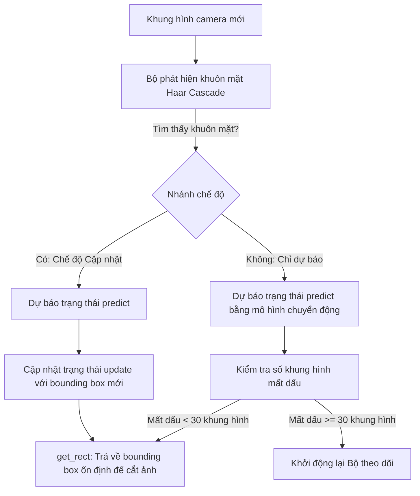

# Báo cáo Dự án Person Re-Identification: CA-Jaccard & Theo dõi với Bộ lọc Kalman (Kalman Filter Tracking)

## 1. Tổng quan về mã nguồn (Source Code Overview)

### Tổng quan kiến trúc mã nguồn (Source Code Architecture Overview)
Dự án này được cấu trúc dưới dạng một kho mã nguồn tương tác và thử nghiệm, kết hợp học không giám sát (unsupervised learning) sử dụng thuật toán **Camera-Aware Jaccard (CA-Jaccard)** với việc theo dõi thời gian thực bằng **Bộ lọc Kalman (Kalman Filter)** cho bài toán Định danh lại người (Person Re-Identification - Person Re-ID). Dự án áp dụng thiết kế phân tách các mối quan tâm (separation of concerns): kiến trúc mô hình, bộ tải dữ liệu (dataset loaders) và logic huấn luyện được tổ chức dưới dạng thư viện trong thư mục [src/](src), trong khi các script thực thi và nghiên cứu thực nghiệm (ablation studies) nằm trong thư mục [scripts/](scripts).

### Cấu trúc cây thư mục (Directory Tree Structure)
Dưới đây là sơ đồ cấu trúc các thư mục và tệp tin chính trong dự án:

```
in-allies-eyes/ (Root)
│
├── README.md                      # Hướng dẫn biên dịch và chạy dự án
├── scripts/                       # Các high-level pipeline wrappers & thực nghiệm
│   ├── demo.py                    # Khởi chạy ứng dụng Gradio demo tương tác
│   ├── download_datasets.py       # Tải và giải nén các tập dữ liệu Market-1501 & CUHK03
│   ├── download_pretrained_models.py # Tải trọng số ResNet50 & các checkpoints đã được huấn luyện trước
│   ├── train_caj.py               # Pipeline huấn luyện chính cho CA-Jaccard không giám sát
│   ├── test.py                    # Pipeline đánh giá để tính toán mAP & Rank-k
│   ├── run_tab3_ablation.py       # Tái lập kết quả Bảng 3 (phân tích triệt tiêu CKRNNs/CLQE/CAJ)
│   └── plot_experiments.py        # Trực quan hóa các neighbors huấn luyện & quét tham số
│
└── src/                           # Thư viện thuật toán cốt lõi và cấu trúc hệ thống
    ├── Kalman_filter/             # Mã nguồn theo dõi đối tượng (target tracking)
    │   └── tracker.py             # Bộ lọc tuyến tính Kalman (Linear Kalman Filter)
    │
    ├── app/                       # Các hàm con phục vụ ứng dụng Gradio demo
    │   ├── reid_engine.py         # Bộ tải mô hình lazy loading đảm bảo an toàn luồng (thread-safe)
    │   ├── gallery_search.py      # Tìm kiếm trên gallery & hiển thị các highlight trên UI
    │   └── webcam_handler.py      # Vòng lặp chụp video OpenCV & phát hiện Haar cascade
    │
    ├── thirdparty/                # Các thuật toán cơ sở từ bên thứ ba
    │   └── bot/                   # Cấu hình & mô hình baseline Bag-of-Tricks (BoT) Re-ID
    │
    └── caj/                       # Thư viện mô hình Camera-Aware Jaccard
        ├── datasets/              # Bộ phân tích tập dữ liệu (Market-1501, CUHK03, MSMT17)
        ├── models/                # Kiến trúc mạng & mô hình ClusterMemory
        ├── evaluation_metrics/    # Tính toán các chỉ số đánh giá (Rank-1, mAP, CMC)
        └── utils/                 # Thuật toán tái xếp hạng CA-Jaccard (caj_rerank.py & rerank.py)
```

---

## 2. Các mô-đun cốt lõi trong CA-Jaccard (Core Modules in CA-Jaccard)

Các mô-đun cốt lõi của dự án thực hiện việc thích ứng miền không giám sát (unsupervised domain adaptation) và tối ưu hóa tìm kiếm ở bước hậu xử lý (post-processing search optimization) bằng cách sử dụng pipeline Camera-Aware Jaccard (CA-Jaccard). Các mô-đun này đảm nhận việc trích xuất đặc trưng (feature extraction), gom cụm (clustering), học tương phản dựa trên bộ nhớ (memory-based contrastive learning) và giảm thiểu sai lệch do góc quay camera (camera bias).

---

### 2.1 Hàm tính toán khoảng cách CA-Jaccard (CA-Jaccard Distance Calculation Function)
* **Đường dẫn:** [rerank.py](src/caj/utils/rerank.py) (hàm `re_ranking`) và [caj_rerank.py](src/caj/utils/caj_rerank.py).
* **Chức năng:** Tái xếp hạng (Re-ranking) điều chỉnh ma trận khoảng cách tương đồng được tính toán giữa ảnh truy vấn (query) và ảnh lưu trữ (gallery) bằng cách phân tích các láng giềng phản hồi gần nhất (k-reciprocal nearest neighbors). Trong các thiết lập đa camera thực tế, các láng giềng phản hồi gần nhất chuẩn thường bị ảnh hưởng nặng nề bởi sai lệch camera (camera bias) do các yếu tố môi trường dùng chung (ánh sáng, hậu cảnh). Hàm tính khoảng cách CA-Jaccard giải quyết vấn đề này bằng cách chia việc tìm kiếm láng giềng thành **Láng giềng nội bộ camera (Intra-Camera Neighbors)** và **Láng giềng liên camera (Inter-Camera Neighbors)**, sau đó chuẩn hóa độc lập từng nhóm để xây dựng một không gian láng giềng không bị ảnh hưởng bởi camera bias.
* **Đoạn mã quan trọng:**
  ```python
  # Tính toán camera mask (cùng camera = True, khác camera = False)
  cam_mask = (cids.reshape(-1, 1) == cids.reshape(1, -1))

  # Tìm kiếm láng giềng phản hồi liên camera (loại bỏ các mục tiêu cùng camera)
  inter_rank = np.argpartition(original_dist + 999.0 * cam_mask, range(k1_inter + 2))
  nn_inter = [k_reciprocal_neigh(inter_rank, i, k1_inter) for i in range(all_num)]

  # Tìm kiếm láng giềng phản hồi nội bộ camera (loại bỏ các mục tiêu khác camera)
  intra_rank = np.argpartition(original_dist + 999.0 * (~cam_mask), range(k1_intra + 2))
  nn_intra = [k_reciprocal_neigh(intra_rank, i, k1_intra) for i in range(all_num)]
  ```
* **Lý do thiết kế (Design Rationale):** Việc phân tách các nhóm láng giềng phản hồi giúp làm giảm thiểu các sai lệch môi trường. Nếu không lọc theo camera, các hình ảnh của những người khác nhau mặc quần áo giống nhau trong cùng một camera sẽ bị xếp gần nhau hơn là cùng một người đó xuất hiện ở các camera khác nhau.
* **Hệ quả nếu thay đổi (Consequences of changes):** Loại bỏ camera mask (`cam_mask`) sẽ làm thuật toán trở về dạng khoảng cách Jaccard chuẩn (KRNNS), khiến chỉ số Rank-1 và mAP giảm mạnh khi chạy kiểm thử mô hình trên các môi trường camera khác biệt.

---

### 2.2 Mô-đun bộ nhớ cụm và hàm mất mát (Cluster Memory Module and Loss Function)
* **Đường dẫn:** [cm.py](src/caj/models/cm.py) (lớp [CM](src/caj/models/cm.py#L9) và [ClusterMemory](src/caj/models/cm.py#L39)).
* **Chức năng:** Lớp [ClusterMemory](src/caj/models/cm.py#L39) lưu trữ động các đặc trưng nguyên mẫu (centroids của các cụm) bên trong một buffer được đăng ký sẵn. Trong quá trình huấn luyện, nó tính toán hàm mất mát tương phản (contrastive loss) bằng cách sử dụng entropy chéo (cross-entropy), đo lường mức độ tương đồng giữa embedding của mẫu hiện tại với nguyên mẫu dương (positive prototype) so với tất cả các nguyên mẫu âm khác (negative prototypes). Ở lượt lan truyền ngược (backward pass), một lớp autograd tùy chỉnh tên là [CM](src/caj/models/cm.py#L9) sẽ xử lý việc cập nhật động các vector nguyên mẫu dựa trên quán tính (momentum-based update) mà không cần tính đạo hàm trực tiếp trên buffer.
* **Đoạn mã quan trọng:**
  ```python
  class CM(autograd.Function):
      @staticmethod
      def forward(ctx, inputs, targets, features, momentum):
          ctx.features = features
          ctx.momentum = momentum
          ctx.save_for_backward(inputs, targets)
          return inputs.mm(ctx.features.t())

      @staticmethod
      def backward(ctx, grad_outputs):
          inputs, targets = ctx.saved_tensors
          grad_inputs = None
          if ctx.needs_input_grad[0]:
              grad_inputs = grad_outputs.mm(ctx.features)

          # Cập nhật động các nguyên mẫu theo cơ chế momentum không cần gradient
          for x, y in zip(inputs, targets):
              ctx.features[y] = ctx.momentum * ctx.features[y] + (1. - ctx.momentum) * x
              ctx.features[y] /= ctx.features[y].norm()

          return grad_inputs, None, None, None
  ```
* **Lý do thiết kế (Design Rationale):** Trong học không giám sát, nhãn mục tiêu (target labels) thay đổi liên tục sau mỗi epoch do các cụm liên tục gộp lại hoặc chia tách. Một đầu phân loại tĩnh (static classifier head - ví dụ như lớp tuyến tính thông thường) không thể tự động thích ứng với kích thước thay đổi của nhãn cụm. Bộ nhớ cụm cập nhật các vector nguyên mẫu mà không cần gradient, ngăn chặn hiện tượng trôi lệch biểu diễn đặc trưng (representation drift).
* **Hệ quả nếu thay đổi (Consequences of changes):** Việc thay đổi tham số tỷ lệ nhiệt độ (`temp`) hoặc vô hiệu hóa bước chuẩn hóa (normalization) trong vòng lặp forward của bộ nhớ cụm sẽ dẫn đến bùng nổ gradient hoặc triệt tiêu gradient, gây mất hội tụ khi huấn luyện.

---

### 2.3 Mạng xương sống (Backbone Network - ResNet50)
* **Đường dẫn:** [resnet.py](src/caj/models/resnet.py) (lớp [ResNet](src/caj/models/resnet.py#L14)).
* **Chức năng:** Đóng vai trò là bộ trích xuất đặc trưng (feature extractor), được khởi tạo từ trọng số ImageNet. Kiến trúc mạng được tinh chỉnh riêng cho bài toán Person Re-ID bằng cách thay đổi stride của khối tích chập (conv-block) ở giai đoạn residual cuối cùng nhằm ngăn chặn việc mất mát quá nhiều độ phân giải không gian. Nó cũng tích hợp các cấu hình pooling thay thế và chuẩn hóa embedding đầu ra.
* **Đoạn mã quan trọng:**
  ```python
  # Sửa đổi layer 4 để giữ độ phân giải không gian cao hơn
  resnet.layer4[0].conv2.stride = (1, 1)
  resnet.layer4[0].downsample[0].stride = (1, 1)
  
  # ...
  # Chuẩn hóa đặc trưng về unit hypersphere trong quá trình suy luận (inference)
  if (self.training is False):
      bn_x = F.normalize(bn_x)
      return bn_x
  ```
* **Lý do thiết kế (Design Rationale):** ResNet50 chuẩn thường giảm kích thước không gian từ 16x8 xuống 8x4 ở `layer4`. Đối với bài toán Re-ID, các vùng ảnh cắt nhỏ chứa nhiều chi tiết quan trọng (ví dụ: kiểu giày, quai túi xách). Việc ép stride bằng 1 giữ nguyên bản đồ không gian 16x8, giúp bảo toàn các đặc trưng cục bộ. Chuẩn hóa đặc trưng đảm bảo khoảng cách Cosine và khoảng cách Euclidean hoạt động đồng nhất.
* **Hệ quả nếu thay đổi (Consequences of changes):** Nếu chuyển stride của `layer4` về lại mức `(2, 2)`, các đặc trưng chi tiết nhỏ sẽ bị mờ đi đáng kể, làm giảm độ chính xác Rank-1 và mAP kiểm thử xuống khoảng 3-5%.

---

### 2.4 Pipeline huấn luyện gom cụm (Clustering Training Pipeline)
* **Đường dẫn:** [train_caj.py](scripts/train_caj.py).
* **Chức năng:** Triển khai vòng lặp huấn luyện không giám sát chính. Tại thời điểm bắt đầu mỗi epoch, hệ thống chạy lượt forward trên dữ liệu huấn luyện, trích xuất các embeddings, tính toán ma trận khoảng cách tái xếp hạng bằng CA-Jaccard, nhóm các vector lại bằng thuật toán gom cụm DBSCAN, gán nhãn giả (pseudo-labels) cho các cụm, cập nhật lại kích thước của bộ nhớ cụm [ClusterMemory](src/caj/models/cm.py#L39) và thực hiện một vòng lặp huấn luyện PyTorch chuẩn với lan truyền ngược (backpropagation).
* **Đoạn mã quan trọng:**
  ```python
  # Trích xuất đặc trưng và tính toán ma trận khoảng cách
  dict_f, _ = extract_features(model, cluster_loader, print_freq=50)
  cf = torch.stack([dict_f[i] for i in sorted(dict_f.keys())])
  
  # Chạy gom cụm (DBSCAN) sử dụng ma trận khoảng cách đã tính toán lại
  rerank_dist = caj_rerank(cf, ...)
  db = DBSCAN(eps=eps, min_samples=4, metric='precomputed', n_jobs=-1)
  labels = db.fit_predict(rerank_dist)
  
  # Cập nhật ClusterMemory với số lượng cụm hiện tại
  num_classes = len(set(labels)) - (1 if -1 in labels else 0)
  m_memory = ClusterMemory(model.num_features, num_classes, temp=0.05, momentum=0.2).cuda()
  ```
* **Lý do thiết kế (Design Rationale):** Khi không có nhãn thủ công, quá trình huấn luyện phụ thuộc hoàn toàn vào nhãn giả. Việc trích xuất đặc trưng lặp đi lặp lại kết hợp gom cụm DBSCAN giúp gom các đặc trưng có cùng định danh người vào một nhóm một cách linh hoạt theo sự thay đổi của mô hình.
* **Hệ quả nếu thay đổi (Consequences of changes):** Nếu tham số epsilon (`eps`) của DBSCAN quá lớn, các định danh khác nhau sẽ bị gộp chung; nếu quá nhỏ, các ảnh của cùng một người sẽ bị phân rã thành nhiều nhãn khác nhau, làm hỏng quá trình huấn luyện.

---

### 2.5 Mô-đun đánh giá và tái xếp hạng (Evaluation and Re-ranking Module)
* **Đường dẫn:** [test.py](scripts/test.py) và [evaluators.py](src/caj/evaluators.py) (lớp [Evaluator](src/caj/evaluators.py#L48)).
* **Chức năng:** Đánh giá độ chính xác Re-ID trên tập dữ liệu kiểm thử. Mô-đun này tính toán khoảng cách giữa các embeddings của tập truy vấn (query) và tập lưu trữ (gallery). Trong quá trình đánh giá, nó áp dụng CA-Jaccard hoặc so khớp cosine baseline và tính toán các đặc tuyến CMC (CMC Rank-1, Rank-5, Rank-10) cùng độ chính xác trung bình (mAP).
* **Đoạn mã quan trọng:**
  ```python
  # Tính toán ma trận khoảng cách query-to-gallery
  distmat = 1 - torch.mm(q_feats, g_feats.t())
  distmat = distmat.cpu().numpy()
  
  # Tích hợp tái xếp hạng (tùy chọn)
  if re_rank:
      distmat = re_ranking(q_g_dist, q_q_dist, g_g_dist, cids, args)
  ```
* **Lý do thiết kế (Design Rationale):** Đánh giá hiệu năng của mô hình bằng cách sử dụng các chỉ số Re-ID chuẩn học thuật, xác minh xem lớp tái xếp hạng hậu xử lý có cải thiện kết quả truy vấn hay không.
* **Hệ quả nếu thay đổi (Consequences of changes):** Vô hiệu hóa chuẩn hóa khoảng cách sẽ tạo ra các điểm số khoảng cách sai lệch, tính toán sai các kết quả xếp hạng.

---

### 2.6 Tiền xử lý dữ liệu (Data Preprocessing)
* **Đường dẫn:** [preprocessor.py](src/caj/utils/data/preprocessor.py) (lớp [Preprocessor](src/caj/utils/data/preprocessor.py#L11)) và [market1501.py](src/caj/datasets/market1501.py).
* **Chức năng:** Chuẩn hóa các định dạng ảnh cắt trước khi đưa vào mô hình. Hình ảnh được tải dưới dạng ảnh màu PIL RGB, thay đổi kích thước về tỷ lệ chuẩn `(256, 128)`, và được chuẩn hóa thông qua PyTorch transforms sử dụng các tham số phân phối ImageNet.
* **Đoạn mã quan trọng:**
  ```python
  normalizer = T_vision.Normalize(mean=[0.485, 0.456, 0.406], std=[0.229, 0.224, 0.225])
  transformer = T_vision.Compose([
      T_vision.Resize((256, 128), interpolation=T_vision.InterpolationMode.BICUBIC),
      T_vision.ToTensor(),
      normalizer
  ])
  ```
* **Lý do thiết kế (Design Rationale):** Việc chuẩn hóa kích thước thành `(256, 128)` phù hợp với tỷ lệ khung hình của người đang đi bộ. Chuẩn hóa phân phối giúp dữ liệu đầu vào tương thích với phân phối đặc trưng của các mạng xương sống đã được tiền huấn luyện trên ImageNet.
* **Hệ quả nếu thay đổi (Consequences of changes):** Sửa đổi kích thước độ phân giải hoặc thay đổi các tham số nội suy sẽ phá vỡ sự tương thích với trọng số checkpoint, làm suy giảm chất lượng các đặc trưng đầu ra.

---

## 3. Mã nguồn ứng dụng Gradio Demo (Demo Application Source Code)

Bên cạnh pipeline huấn luyện và đánh giá, kho mã nguồn này còn tích hợp một ứng dụng web tương tác được xây dựng bằng Gradio. Ứng dụng demo cho phép người dùng khởi chạy webcam, theo dõi khuôn mặt/đối tượng theo thời gian thực, cắt ảnh truy vấn, thực hiện tìm kiếm trên gallery và so sánh hiệu quả của các cấu hình theo dõi và tái xếp hạng khác nhau.

---

### 3.1 Động cơ ReID — Quản lý mô hình (ReID Engine — Model Management)
* **Đường dẫn:** [reid_engine.py](src/app/reid_engine.py).
* **Chức năng:** Lazy-loads các checkpoints mô hình sâu theo yêu cầu (chỉ khi có thao tác chụp ảnh hoặc tìm kiếm truy vấn) và lưu trữ chúng trong một cấu trúc từ điển toàn cục (global cache). Nó triển khai một khóa luồng (threading lock) để đảm bảo mô hình hoạt động an toàn luồng trong trường hợp có nhiều yêu cầu truy vấn đồng thời từ người dùng, đồng thời tự động phân tích số lượng nhãn lớp mục tiêu trực tiếp từ hình dạng trọng số của bộ phân loại (classifier weight shape) trong checkpoint.
* **Đoạn mã quan trọng:**
  ```python
  reid_models = {}
  reid_model_lock = threading.Lock()

  def get_reid_model(dataset_name="Market1501"):
      global reid_models
      key = "cuhk03" if dataset_name == "CUHK03" else "market1501"
      
      if key in reid_models:
          return reid_models[key]

      with reid_model_lock:
          if key not in reid_models:
              # Logic cấu hình mô hình ...
              checkpoint = load_checkpoint(checkpoint_path)
              num_classes = checkpoint['state_dict']['classifier.weight'].shape[0]
              
              raw_model = Baseline(num_classes=num_classes, model_name='resnet50', ...)
              model = NormalizedFeatureModel(raw_model, normalize=True)
              copy_state_dict(checkpoint['state_dict'], model.model)
              
              model.eval()
              reid_models[key] = (model, device)
      return reid_models[key]
  ```

---

### 3.2 Tìm kiếm trên Gallery — Tìm kiếm và Đối sánh (Gallery Search — Search and Matching)
* **Đường dẫn:** [gallery_search.py](src/app/gallery_search.py) (hàm `search_gallery`).
* **Chức năng:** Điều phối việc đối sánh trên gallery. Để đảm bảo thời gian phản hồi nhanh, hệ thống nạp chậm (lazy load) các đặc trưng gallery đã tính toán trước (ví dụ: `market1501_gallery_features.npz`) và tính toán bảng xếp hạng tương đồng. Nó chạy tái xếp hạng Jaccard cục bộ trên top 200 kết quả hàng đầu (rút ngắn thời gian xử lý xuống dưới 0.05s) và áp dụng các hiệu ứng viền trên giao diện (viền vàng cho ảnh cùng camera, viền xanh lá cho các kết quả được cải thiện thứ hạng).
* **Đoạn mã quan trọng:**
  ```python
  # Giới hạn CA-Jaccard trên Top-200 ứng viên để tránh trễ giao diện
  initial_indices = np.argsort(dist)
  top_200_indices = initial_indices[:200]
  
  if use_caj:
      q_g_dist = dist[top_200_indices].reshape(1, 200)
      top_200_features = g_f[top_200_indices]
      g_g_dist = 1.0 - np.dot(top_200_features, top_200_features.T)
      
      final_dist = re_ranking(q_g_dist, q_q_dist, g_g_dist, cids, args)
      reranked_sub_indices = np.argsort(final_dist[0])
      final_top_indices = top_200_indices[reranked_sub_indices]
  ```

---

### 3.3 Bộ xử lý Webcam — Xử lý camera thời gian thực (Webcam Handler — Real-time Camera Processing)
* **Đường dẫn:** [webcam_handler.py](src/app/webcam_handler.py).
* **Chức năng:** Nhận luồng khung hình từ webcam hệ thống ở tốc độ 10-15 FPS. Các khung hình được xử lý bằng bộ phát hiện khuôn mặt Viola-Jones Haar Cascade để định vị khuôn mặt. Tọa độ phát hiện sau đó được đưa vào Bộ lọc Kalman để hiển thị hai hộp giới hạn (bounding box): màu đỏ (khung phát hiện thô) và màu xanh lá (khung đã được làm mượt bằng bộ lọc).
* **Đoạn mã quan trọng:**
  ```python
  faces = face_cascade.detectMultiScale(gray, scaleFactor=1.1, minNeighbors=5, minSize=(30, 30))
  if len(faces) > 0:
      x, y, w, h = faces[0]
      raw_bbox = (int(x), int(y), int(w), int(h))
  ```

---

### 3.4 Bộ theo dõi Bộ lọc Kalman (Kalman Filter Tracker)
* **Đường dẫn:** [tracker.py](src/Kalman_filter/tracker.py) (lớp [KalmanTracker](src/Kalman_filter/tracker.py#L3)).
* **Chức năng:** Triển khai bộ lọc tuyến tính Kalman sử dụng mô hình chuyển động vận tốc không đổi (constant velocity motion model). Bộ lọc theo dõi các hộp giới hạn để giảm thiểu hiện tượng rung giật (jitter) phát hiện và xử lý các tình huống đối tượng bị che khuất tạm thời (occlusions).

#### Quy trình xử lý theo dõi của bộ lọc Kalman từng bước:


1. **Cấu hình Vectơ Trạng thái (State Vector Configuration):**
   Vectơ trạng thái $x$ theo dõi các thông số vị trí và vận tốc:
   $$x = [cx, cy, a, h, v_{cx}, v_{cy}, v_a, v_h]^T$$
   * $cx, cy$: Tọa độ tâm của hộp giới hạn (bounding box)
   * $a$: Tỷ lệ khung hình của hộp giới hạn ($w / h$)
   * $h$: Chiều cao của hộp giới hạn
   * $v_*$: Vận tốc thay đổi của từng thành phần tương ứng
2. **Giai đoạn Dự báo (Prediction Phase - [predict](src/Kalman_filter/tracker.py#L40)):**
   Tính toán trạng thái dự kiến tiếp theo dựa trên ma trận chuyển trạng thái $F$ (cộng thêm vận tốc vào vị trí với giả định $dt=1$) và cập nhật ma trận hiệp phương sai sai số $P$ kết hợp nhiễu hệ thống $Q$:
   $$x_{k|k-1} = F x_{k-1|k-1}$$
   $$P_{k|k-1} = F P_{k-1|k-1} F^T + Q$$
3. **Giai đoạn Cập nhật / Hiệu chỉnh (Correction Phase - [update](src/Kalman_filter/tracker.py#L53)):**
   Khi bộ phát hiện trả về kết quả đo $z = [cx, cy, a, h]^T$, bộ lọc tính toán phần dư đo lường $y$, ma trận chiếu đo lường $S$, hệ số tăng Kalman $K$ (trọng số cân bằng giữa dự báo lý thuyết và số liệu đo thực tế), sau đó cập nhật lại trạng thái và hiệp phương sai sai số:
   $$y = z - H x_{k|k-1}$$
   $$S = H P_{k|k-1} H^T + R$$
   $$K = P_{k|k-1} H^T S^{-1}$$
   $$x_{k|k} = x_{k|k-1} + K y$$
   $$P_{k|k} = (I - K H) P_{k|k-1}$$
4. **Chuyển đổi Hộp giới hạn (Bounding Box Conversion - [get_rect](src/Kalman_filter/tracker.py#L90)):**
   Chuyển đổi ngược các thông số trạng thái $cx, cy, a, h$ về định dạng tọa độ góc trên bên trái $[x, y, w, h]$ tiêu chuẩn để thực hiện cắt ảnh truy vấn ổn định.

* **Đoạn mã quan trọng:**
  ```python
  def predict(self):
      if self.state is None:
          return
      self.state = np.dot(self.F, self.state)
      self.P = np.dot(np.dot(self.F, self.P), self.F.T) + self.Q
      self.mode = "Predict only"

  def update(self, bbox):
      x, y, w, h = bbox
      cx = x + w / 2.0
      cy = y + h / 2.0
      a = float(w) / float(h) if h > 0 else 0.0
      z = np.array([[cx], [cy], [a], [h]])

      if self.state is None:
          # Khởi tạo trạng thái ở khung hình đầu tiên
          self.state = np.zeros((8, 1))
          self.state[0:4] = z
          self.P = np.eye(8) * 10.0
          self.status = "Found"
          self.mode = "Update"
          return

      # Các phương trình hiệu chỉnh trạng thái
      y_residual = z - np.dot(self.H, self.state)
      S = np.dot(np.dot(self.H, self.P), self.H.T) + self.R
      K = np.dot(np.dot(self.P, self.H.T), np.linalg.inv(S))
      self.state = self.state + np.dot(K, y_residual)
      self.P = np.dot(np.eye(8) - np.dot(K, self.H), self.P)
      
      self.status = "Found"
      self.mode = "Update"
  ```
