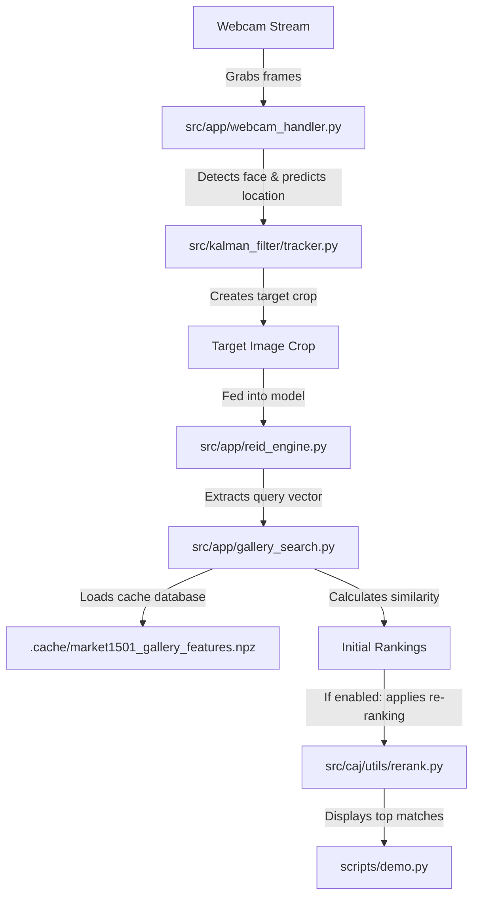
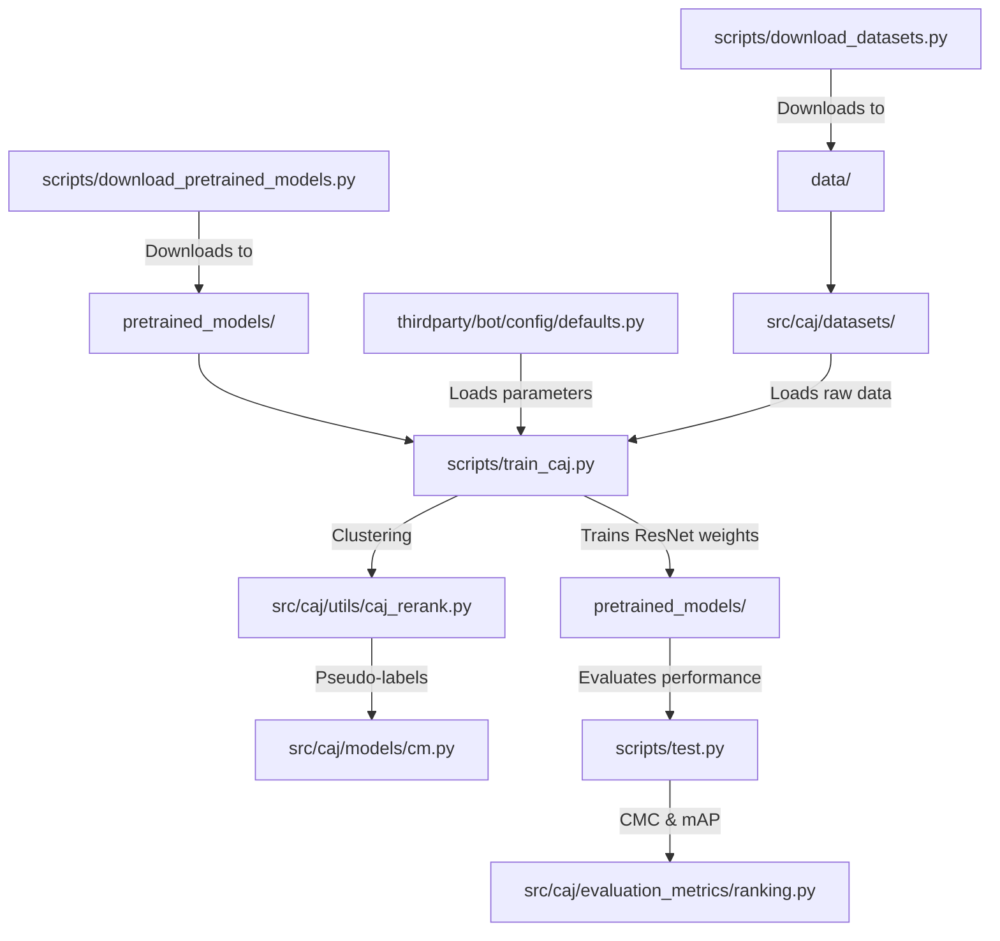

# Source Code Demonstration

This document details the technology stack, project folder structure, and runtime execution pipelines for both the interactive web application and the training/evaluation systems.

---

## 1. Technology Stack & Frameworks

The project leverages several Python libraries to handle deep learning, data processing, and user interfaces:

| Library | Role in Project | Where it is used |
| :--- | :--- | :--- |
| **PyTorch (`torch`)** | Deep learning framework. Used to load pre-trained CNNs, extract features, and train the Re-ID model. | [train_caj.py](../scripts/train_caj.py), [src/caj/models/](../src/caj/models/) |
| **Gradio** | Web UI framework. Creates the interactive tabs, video views, and buttons for this demo application. | [demo.py](../scripts/demo.py) |
| **OpenCV (`opencv-python`)** | Image & Video processing. Reads webcam frames, draws the raw (**Red**) and tracked (**Green**) bounding boxes, and crops query images. | [webcam_handler.py](../src/app/webcam_handler.py) |
| **Scikit-learn (`sklearn`)** | Machine Learning algorithms. Provides the **DBSCAN** clustering algorithm used to group similar features together during training. | [train_caj.py](../scripts/train_caj.py#L12) |
| **YACS** | Configuration management. Used by the Bag-of-Tricks (BoT) baseline to load YAML configurations cleanly. | [thirdparty/bot/](../thirdparty/bot/) |
| **NumPy / SciPy** | Scientific computing. Performs vector math, calculates distance matrices, and sorts rankings. | [rerank.py](../src/caj/utils/rerank.py) |

---

## 2. Directory Structure Description

Here is an architectural map of this repository. 

*   `in-allies-eyes/` (Root)
    *   [README.md](../README.md) - Project setup, installation steps, and commands for experiments.
    *   [requirements.txt](../requirements.txt) - Python package dependencies.
    *   [thirdparty/bot/](../thirdparty/bot/) - Sub-repository containing the **Bag-of-Tricks (BoT)** Re-ID baseline model structures.
    *   [pretrained_models/](../pretrained_models/) - Folder for holding loaded/trained Re-ID model weights.
    *   [data/](../data/) - Target folder for holding Market1501 and CUHK03 raw datasets.
    *   [scripts/](../scripts) (Execution Scripts)
        *   [demo.py](../scripts/demo.py) - Interactive Gradio demo app incorporating webcam/tracking and gallery search.
        *   [download_datasets.py](../scripts/download_datasets.py) - Automates downloads of Market1501 and CUHK03 datasets.
        *   [download_pretrained_models.py](../scripts/download_pretrained_models.py) - Fetches ResNet50 backbone weights and trained checkpoints.
        *   [train_caj.py](../scripts/train_caj.py) - Training loop for CA-Jaccard model using ClusterMemory.
        *   [test.py](../scripts/test.py) - Evaluation script to measure model performance (mAP, Rank-1).
        *   [run_tab3_ablation.py](../scripts/run_tab3_ablation.py) - Runs ablation experiments (reproducing Table 3 from the reference paper).
        *   [run_fig4_params.py](../scripts/run_fig4_params.py) - Runs hyperparameter sweeps for clustering.
        *   [plot_experiments.py](../scripts/plot_experiments.py) - Generates figures and result tables from experimental logs.
    *   [src/](../src) (Core Library Logic)
        *   [app/](../src/app) - Helper modules for the Gradio demo application:
            *   [webcam_handler.py](../src/app/webcam_handler.py) - Handles webcam video capture, Haar cascade detector, and target crop extraction.
            *   [gallery_search.py](../src/app/gallery_search.py) - Orchestrates query processing, gallery search, and CA-Jaccard re-ranking.
            *   [reid_engine.py](../src/app/reid_engine.py) - Manages lazy-loading and inference of deep learning Re-ID models.
        *   [kalman_filter/](../src/kalman_filter) - Kalman filter tracking implementation (`tracker.py`) used to smooth noisy bounding boxes.
        *   [caj/](../src/caj) (Camera-Aware Jaccard Model Library)
            *   [datasets/](../src/caj/datasets) - Specialized dataset parsers (GRID, Market1501, MSMT17).
            *   [models/](../src/caj/models) - Model structures (ResNet backbone, ClusterMemory module).
            *   [evaluation_metrics/](../src/caj/evaluation_metrics) - Code for calculating CMC curves and mAP.
            *   [utils/](../src/caj/utils) - CA-Jaccard mathematical engines ([rerank.py](../src/caj/utils/rerank.py) and [caj_rerank.py](../src/caj/utils/caj_rerank.py)).

---

## 3. Workflows & Pipelines

This section details how the files connect and invoke one another during runtime operations.

### 3.1. Gradio Demo Application Pipeline

This workflow describes the image acquisition, tracking, and matching pipeline used when running this demo application.

#### Step-by-Step Walkthrough:
1.  **Interface Initialization:** The Gradio server is initialized and launched from the entrypoint [scripts/demo.py](../scripts/demo.py).
2.  **Video Stream Acquisition:** When the user clicks "Start Camera", a generator loop in [src/app/webcam_handler.py](../src/app/webcam_handler.py) opens a CV2 camera channel and captures frames.
3.  **Face Bounding Box Detection:** Each frame is converted to grayscale and scanned by a Haar Cascade classifier inside [src/app/webcam_handler.py](../src/app/webcam_handler.py) to locate facial boundary coordinates.
4.  **Kalman State Prediction & Smoothing:** The coordinates are sent to [src/kalman_filter/tracker.py](../src/kalman_filter/tracker.py) where the constant velocity motion equations calculate box positions, smoothing out jitter and predicting positions if the face is briefly blocked.
5.  **Query Bounding Box Capture:** Clicking "Capture Query" triggers [src/app/webcam_handler.py](../src/app/webcam_handler.py) to crop the target face, save the crop to the disk, and pass it directly to Tab 2's query box.
6.  **Re-ID Backbone Lazy Loading:** The deep learning model for the selected dataset is loaded into the graphics card memory using [src/app/reid_engine.py](../src/app/reid_engine.py).
7.  **Pair-wise Similarity Comparison:** The query crop is resized to $256 \times 128$ and processed by the model to generate a normalized query feature vector. This vector is compared against pre-computed gallery vectors cached in the `.cache/` folder to yield initial cosine distances in [src/app/gallery_search.py](../src/app/gallery_search.py).
8.  **CA-Jaccard Re-ranking Optimization:** If checked, the distances are modified based on shared reciprocal neighbors in [src/caj/utils/rerank.py](../src/caj/utils/rerank.py) to remove background camera bias.
9.  **Results Render:** Top matches are displayed in the results panels in [scripts/demo.py](../scripts/demo.py) with custom colored borders (yellow for same camera, green for rank improvements).

---

### 3.2. Training and Evaluation Pipeline

This workflow describes the experimental pipeline used to train new models and evaluate search precision metrics.

#### Step-by-Step Walkthrough:
1.  **Downloading Datasets:** Run [scripts/download_datasets.py](../scripts/download_datasets.py) to download and extract dataset archives into the [data/](../data/) directory.
2.  **Downloading Pretrained Models:** Run [scripts/download_pretrained_models.py](../scripts/download_pretrained_models.py) to download and extract pre-trained baseline network weights into the [pretrained_models/](../pretrained_models/) directory.
3.  **Hyperparameter Config:** Training parameters, models config, and directories are set up using [thirdparty/bot/config/defaults.py](../thirdparty/bot/config/defaults.py).
4.  **Dataset Preprocessing:** Raw image folders and split configurations (train/test images metadata) are loaded into Python memory using parser classes under [src/caj/datasets/](../src/caj/datasets/).
5.  **Pseudo-Label Clustering:** Feature vectors of unlabeled training images are calculated, and pair-wise Jaccard distances are computed using [src/caj/utils/caj_rerank.py](../src/caj/utils/caj_rerank.py). DBSCAN clusters similar features into identity groupings inside [scripts/train_caj.py](../scripts/train_caj.py).
6.  **Weights Optimization (Training):** The ResNet backbone network is optimized via contrastive learning inside [src/caj/models/cm.py](../src/caj/models/cm.py), updating the cluster features and saving checkpoint weights to the `pretrained_models/` directory.
7.  **Accuracy Metrics Evaluation:** The script [scripts/test.py](../scripts/test.py) loads the model weights and evaluates search precision (Rank-k accuracy and mAP) using calculators in [src/caj/evaluation_metrics/ranking.py](../src/caj/evaluation_metrics/ranking.py) to verify performance.
